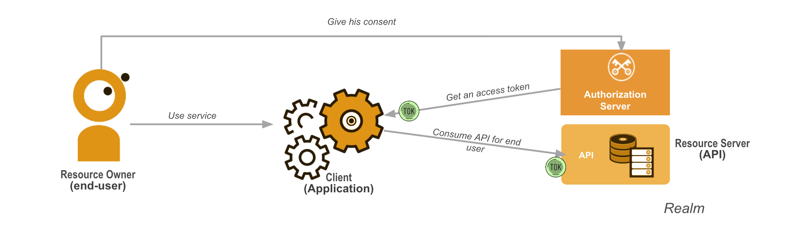
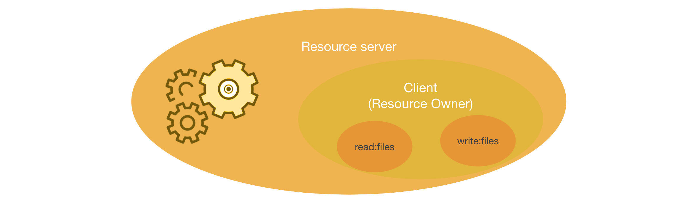
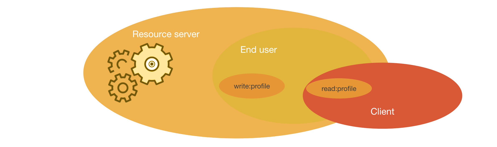

# Scopes, roles and accreditations

## Use-case



In this use case, the user (resource owner) uses an web application (client) which consumes a protected API (resource server).
The OpenId/OAuth provider is out of scope.

Example authentication token :

```json
{
    "active": true,
    "client_id": "l238j323ds-23ij4",
    "username": "jdoe",
    "scope": "read:cart write:cart",
    "sub": "Z5O3upPC88QrAjx00dis",
    "aud": "https://protected.example.net/resource",
    "iss": "https://server.example.com/",
    "exp": 1419356238,
    "iat": 1419350238,
    "extension_field": "twenty-seven"
}
```

## Definitnions

### Scope


Scopes are permissions that have been granted to the client

It’s a list of words which describe a subset of privileges of the resource owner
The actual privileges of a client are the intersection of the scope and the privileges of the resource owner

### Roles

A role is a group or type of users who shares the same objectives when using an application.
Example : In a market place like application, we can imagine 3 roles : *sellers*, *vendors*, *administrators*.

### Accreditations

Accreditations are fine grained user access management. This check is done within the application to grant or not the access to a specific resource (the resource access can be done on id, or by any other information). This is often refered as ACL.
Example : If we take again the market place application, we can imagine a seller being able to modify only his goods and not the ones from other sellers or imagine having multiple user profiles, such as *developper* et or *maintainer* on a github repo.

## Scopes in detail

### Scopes without end user

This scenarri describes the privileges of a client communicating with a resource server (back-to-back communication).



- Scopes are permissions owns by the client
- The privileges of a client is the scope granted by the resource server during enrollment

### Scopes with access delegation

In this scenarii, the user wants to grant access to a client only to a subset of his privileges.



- Scopes are permissions that have been granted to the client
- It’s a list of words which describe a subset of privileges of the resource owner
- The actual privileges of a client are the intersection of the scope and the privileges of the resource owner

### Naming recommendation

Excplicit naming should uniquely identify the resources accessible (or the API endmoints accessible).

Our recommendation si to use the form :
read:<resource_name>
write:<resource_name>

Example of a JWT issued to a client with *read only* acces to the cart
```json
{
    [...]
    "client_id": "l238j323ds-23ij4",
    "username": "jdoe",
    "scope": "read:cart",
    "sub": "Z5O3upPC88QrAjx00dis",
    [...]
}
```

Example of a JWT issued to a client with *read* and *write* acces to the cart
```json
{
    [...]
    "client_id": "azdzbahjbhbj1234",
    "username": "jdoe",
    "scope": "read:cart write:cart",
    "sub": "Z5O3upPC88QrAjx00dis",
    [...]
}
```
